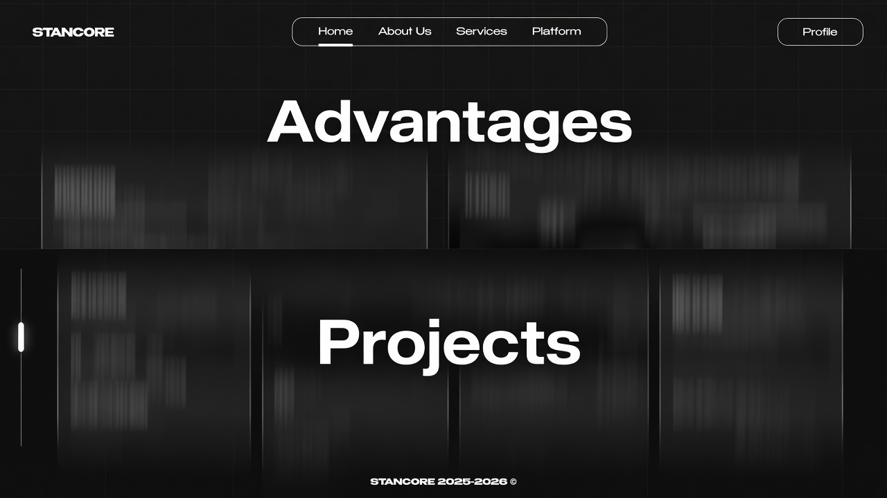

# Anchor JS

Full-screen section navigation for the web. Replaces native page scrolling with discrete section switching, scroll locking, and a vertical progress indicator.

Part of the [Stancore](https://stancore.net) ecosystem. Live API docs: [api.stancore.net/docs/anchor-js](https://api.stancore.net/docs/anchor-js).

<p align="center">
  
</p>

Open the live-style demo: [`examples/basic.html`](examples/basic.html) (scroll, swipe, or drag the rail).

## Quick start — CDN

Declare a global `sectionIds` array **before** loading the script. Each ID must match a section element on the page.

```html
<script>
  var sectionIds = ['hero', 'about', 'contact'];
</script>
<script src="https://api.stancore.net/api/anchor-js"></script>
```

Add the progress rail markup and include CSS (from this repo or your own styles):

```html
<link rel="stylesheet" href="https://cdn.jsdelivr.net/gh/AntDiMank/AnchorJS@main/dist/anchor.css">

<div class="anchor-bar anchor-progress" aria-label="Section progress">
  <span class="anchor-progress-track">
    <span class="anchor-progress-thumb" id="anchor-thumb">
      <span class="anchor-tooltip" id="anchor-tooltip">Hero</span>
    </span>
  </span>
</div>

<main class="content">
  <section id="hero">...</section>
  <section id="about">...</section>
  <section id="contact">...</section>
</main>
```

CDN endpoint for the script: `https://api.stancore.net/api/anchor-js`  
jsDelivr (this repository):

```html
<script src="https://cdn.jsdelivr.net/gh/AntDiMank/AnchorJS@main/dist/anchor.js"></script>
```

## Quick start — local files

1. Copy [`dist/anchor.js`](dist/anchor.js) and [`dist/anchor.css`](dist/anchor.css) into your project.
2. Open [`examples/basic.html`](examples/basic.html) for a full-bleed visual demo (scroll / swipe / drag the rail), or wire it up yourself:

```html
<link rel="stylesheet" href="dist/anchor.css">
<!-- markup: sections + #anchor-thumb -->
<script>
  var sectionIds = ['hero', 'about', 'contact'];
</script>
<script src="dist/anchor.js"></script>
```

## Required setup

| Parameter | Type | Required | Description |
|-----------|------|----------|-------------|
| `sectionIds` | `string[]` | Yes | Global array of section element IDs in navigation order. Must be declared **before** the script tag. |
| `#anchor-thumb` | DOM element | Recommended | Progress thumb inside `.anchor-progress-track`. |
| `.left-nav .nav-item` | DOM elements | Optional | Links with `href="#section-id"` for click-to-navigate. |

## Behavior

On load the library:

- adds `anchor-lock-mode` to `body` and scrolls to `(0, 0)`;
- shows the active section (`display` + `is-anchor-active` + `anchor-anim-in`);
- hides inactive sections (`display: none`, `aria-hidden="true"`);
- moves the progress thumb with `translate(-50%, {offset}px)`.

**Controls:** mouse wheel, Arrow Up/Down, Page Up/Down, Space, touch swipe (≥ 35 px), drag/click on the progress track.

**Debounce:** section switches are locked for **500 ms**. Wheel delta threshold: **8 px**.

**Hash:** if the URL hash matches an ID in `sectionIds` on load (or on `hashchange`), that section opens. The library does **not** write the hash while navigating.

**Ignored when:** a modal is open (`.modal-open` / `.modal-overlay.is-active`), or focus is in `input` / `textarea` / `select` / `contenteditable` / forms.

Tall content: use internal scrolling inside the active section; page scroll stays locked.

## Errors and edge cases

| Condition | Behavior | Notes |
|-----------|----------|-------|
| `sectionIds` undefined | Fatal `ReferenceError` | Define the global array before the script. |
| No matching DOM elements | Silent exit | No side effects if every ID is missing. |
| Invalid ID in the array | Filtered | Missing IDs are skipped. |
| Missing `#anchor-thumb` | Degraded | Sections still switch; progress UI does not update. |
| Single section | Limited | Thumb is not repositioned. |

## Limitations

- Configuration is only via the global `sectionIds` variable (no options object / data attributes in the public build).
- Native page scroll is locked (`body { overflow: hidden }`).
- Designed for full-viewport sections.
- On production Stancore domains, load over **HTTPS**.

## Repository layout

```
dist/anchor.js           # Public library build (same as /api/anchor-js)
dist/anchor.css          # Minimal progress-rail styles
examples/basic.html      # Full-bleed visual demo
examples/assets/*.jpg    # Demo photography
```

## License

MIT — see [LICENSE](LICENSE).
